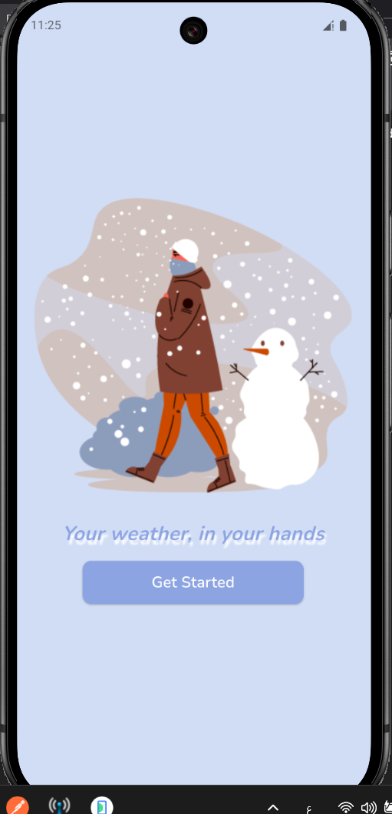
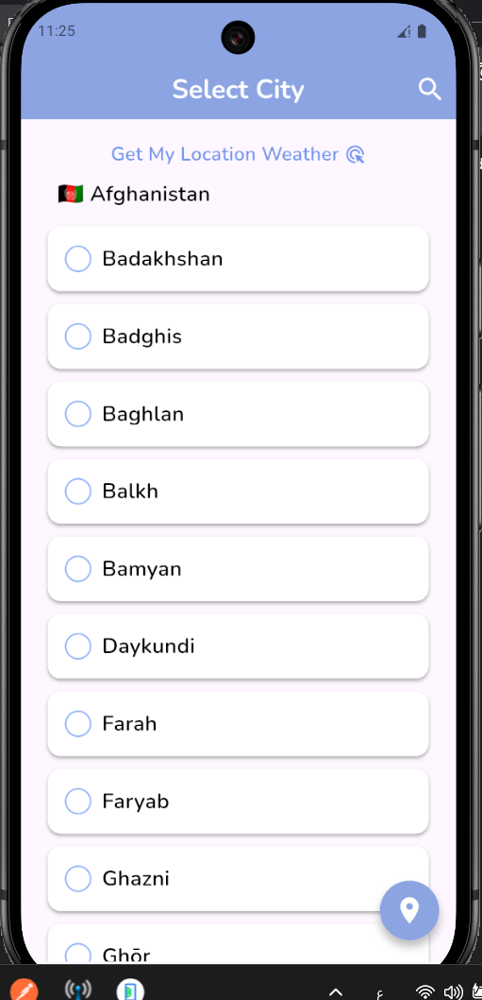
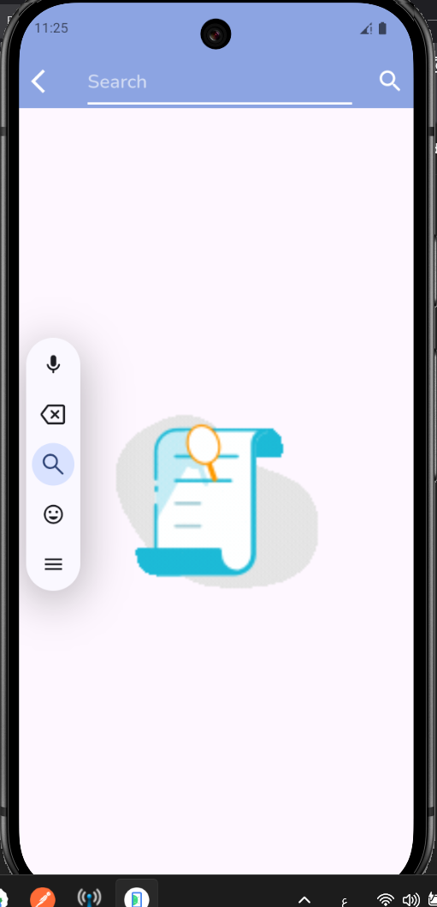
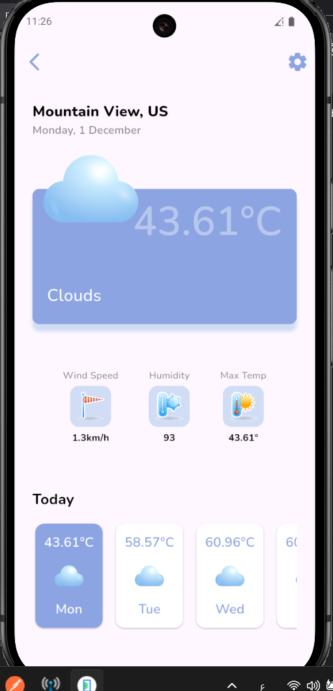
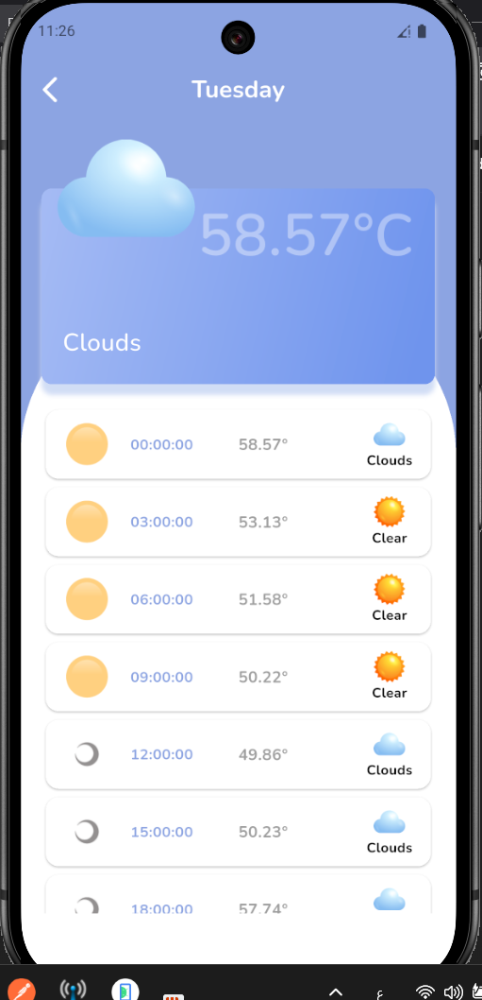

# My Weather 🌤️

https://img.shields.io/badge/Flutter-3.16-blue
https://img.shields.io/badge/Dart-3.0-blue
https://img.shields.io/badge/License-MIT-green
https://img.shields.io/badge/API-OpenWeatherMap-orange
https://img.shields.io/badge/Download-APK-brightgreen

A Flutter weather application that displays current weather conditions
and 5-day forecasts, supports offline mode, and provides an elegant and
simple user experience.

## 📱 Features

-   🌍 Search weather for any city worldwide
-   📍 Automatic location detection using GPS
-   🌡️ Temperature display (°C / °F)
-   💨 Humidity and wind speed details
-   ☀️ Dynamic weather icons based on current conditions
-   📅 5-day weather forecast
-   💾 Offline support using locally stored data
-   🔍 City search with a built-in picker
-   🎨 Clean, simple, user-friendly UI

📋 System Requirements:

    - Android: 6.0 (Marshmallow) or higher
    -Internet: Required for weather data updates
    -Location: GPS service (optional)
    -Storage: 50MB free space

## 🛠️ Technologies Used

### Frontend

-   Flutter 3.16
-   Dart 3.0

### HTTP Client

-   http package

### API

    https://api.openweathermap.org/data/2.5/forecast?lat={lat}&lon={long}&appid={apiKey}&units={unit}

### Location Services

-   geolocator
-   geocoding

### UI Components

-   uni_country_city_picker

### Date Formatting

-   intl

### Local Storage

-   shared_preferences

### Network Status

-   connectivity_plus

### Icons

-   Default Flutter icons

### App Tools

-   flutter_launcher_icons
-   rename
   
### App Launcher Icon
|  |


## 📂 Project Structure

    The project follows a clean and organized directory structure:
        ```
        assets
        ├─ fonts
        └─ images

        build
        └─ <build files>

        lib
        ├─ constant/
        ├─ helper/
        ├─ model/
        ├─ customWidget/
        ├─ services/
        ├─ screens/
        └─ main.dart

        test
        └─ widget_test.dart
        ```

## 🚀 Usage

### First Launch

-   App requests location permission\
-   Enter your API key

### Search

-   Tap search icon\
-   Enter city

### Offline Mode

-   Shows last saved data

### Switch Units

-   Tap temperature

## 🎥 Application Demo

🎬 https://www.youtube.com/watch?v=STv2Aqc6vsU

## 📷 Screenshots

|Splash Screen | Choose City Screen |
| --- | --- |
|  |  |

|Search Screen | Home Screen |
| --- | --- |
|  |  |

|Change Temperature | Day Weather Details Screen |
| --- | --- |
|  |  |

## 📦 Installation for Developers

  Prerequisites:
   -Flutter SDK 3.16+
   -Dart SDK 3.0+
   -Android Studio / VS Code
   -Emulator or physical device
   
## Installation Steps

    ```
    # 1. Clone the project
    git clone https://github.com/yourusername/my-weather.git
    cd my-weather
    
    # 2. Install dependencies
    flutter pub get
    
    # 3. Generate app icons
    flutter pub run flutter_launcher_icons:main
    
    # 4. Run the app
    flutter run
    ```

## Build APK

    ```
    # Build release version
    flutter build apk --release
    
    # Build smaller version
    flutter build apk --split-per-abi --release
    
    # File will be in:
    # build/app/outputs/flutter-apk/app-release.apk
    ```

## ⚙️ Setup & Configuration

   1. Get API Key
        1. Register on OpenWeatherMap
        2. Create a free account
        3. Go to My API Keys
        4. Copy your key
    2. Add Key to App
        For Development:
            ```dart
           // In AppStrings file
            const String apiKey = "YOUR_API_KEY_HERE";  
            ```

## 🤝 Contributing

We welcome your contributions! Follow these steps:
    1. Fork the project
    2. Create a new branch:
        ```
        git checkout -b feature/feature-name
        ```
    3. Commit your changes:
         ```
        git commit -m 'Add new feature'
        ```
    4. Push to the branch:
        ```
        git push origin feature/feature-name
        ```
    5. Open a Pull Request

## Contribution Guidelines

- Follow existing code style
- Write tests for new features
- Update documentation when needed
- Ensure all tests pass

## 🐛 Reporting Issues

If you find a bug or have a suggestion:
    1. Search Issues first
    2. If not found, create a new Issue
    3. Include:
        - Problem description
        - Reproduction steps
        - Screenshot if possible
        - App version

## 📜 License

Open-source

## 📞 Contact & Support

Developer: Sama Abdallah Shurrab
Email: smshorap@gmail.com

## 🙏 Acknowledgements

- OpenWeatherMap - For the great free API
- Flutter Team - For the excellent framework
- Contributors - For their valuable efforts
- Users - For their trust and support

## ⭐ Supporting the Project

If you like the project:
    1. ⭐ Give it a star on GitHub
    2. 🔄 Share it with friends
    3. 🐛 Help find bugs
    4. 💻 Contribute to development
    
## Developed with ❤️ by Sama Shurrab

<div align="center">
https://img.shields.io/github/stars/yourusername/my-weather?style=social
https://img.shields.io/github/forks/yourusername/my-weather?style=social
https://img.shields.io/github/issues/yourusername/my-weather

</div>
